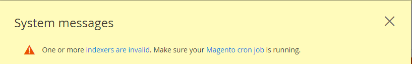
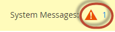

# Magento 2 Upgrade Documentation

> The documentation below assumes you are using the user `shopgc` (whose base folder [type `cd`] is also the Magento install directory).

## Quick Start Guide to Updating from the command line

> The following is a shortened version of the information found below.

```bash
# Log in to your Magento server as, or switch to, the Magento file system owner.
# Change to the directory in which you installed the Magento software.

# For example, cd /var/www/html/magento2

# Enter the following commands in the order shown:

composer require <product> <version> --no-update
composer update

# For example, to upgrade to Magento Open Source version 2.0.13, enter:

composer require magento/product-community-edition 2.0.13 --no-update
composer update

# If prompted, enter your authentication keys.

# Manually clear var subdirectories:

rm -rf <Magento install dir>/var/cache/*
rm -rf <Magento install dir>/var/page_cache/*
rm -rf <Magento install dir>/var/generation/*

# Update the database schema and data:

php bin/magento setup:upgrade

# Put your storefront online (that is, cancel maintenance mode):

php bin/magento maintenance:disable

# Access your storefront.

# The following error might display:

# We're sorry, an error has occurred while generating this email.
# If so, perform the following tasks:

# Reset file system ownership and permissions as a user with root privileges.
# Clear the following directories and try again:

<your Magento install dir>/var/cache
<your Magento install dir>/var/page_cache
<your Magento install dir>/var/generation
```

## [Command-line upgrade](https://devdocs.magento.com/guides/v2.2/comp-mgr/cli/cli-upgrade.html)

You can upgrade Magento from the command line if you installed the software using any of the following:

- Downloaded the metapackage using `composer create-project`
- Installed the compressed archive

> If you cloned the Magento 2 GitHub repository, you **cannot** use this method to upgrade; instead, see [Update the Magento application](https://devdocs.magento.com/guides/v2.2/install-gde/install/cli/dev_update-magento.html).

### Pre-upgrade checklist

Before you continue, to avoid errors during your installation or update, make sure you verify all of the following:

- You set up a [Magento file system owner](https://devdocs.magento.com/guides/v2.2/comp-mgr/cli/cli-upgrade.html#magento-owner-group) and shared that owner’s group with the web server user group
- Your [cron jobs](https://devdocs.magento.com/guides/v2.2/comp-mgr/cli/cli-upgrade.html#magento-cron) are set up and running
- [Set a value for `DATA_CONVERTER_BATCH_SIZE`](https://devdocs.magento.com/guides/v2.2/comp-mgr/cli/cli-upgrade.html#batch-size)
- [File system permissions](https://devdocs.magento.com/guides/v2.2/comp-mgr/cli/cli-upgrade.html#perms) are set properly

> Do not continue without performing these checks. Failure to do so could result in errors.

### Set a value for `DATA_CONVERTER_BATCH_SIZE`

Magento 2.2 includes security enhancements that requires some data to be converted from serialized data format to JSON encoded format. This conversion occurs during the upgrade and it can take a long time, depending on how much data is in your Magento database.

One or more fields in the following tables are affected: `sales_order`, `sales_order_payment`, `quote`, `quote_payment`, `core_config_data`, `magento_reward_history`, `url_rewrite`, `salesrule`, and `catalogrule`. (This is not a complete list.)

If you have a large amount of data, you can improve performance by setting the value of an environment variable, `DATA_CONVERTER_BATCH_SIZE`. By default, it’s set to a value of 50,000.

To set the variable, before the upgrade starts enter the following command as the Magento file system owner in a bash shell prompt:

```bash
export DATA_CONVERTER_BATCH_SIZE <value>
```

For example,

```bash
export DATA_CONVERTER_BATCH_SIZE 100000
```

After your upgrade completes, you can unset the variable as follows:

```bash
unset DATA_CONVERTER_BATCH_SIZE
```

> `DATA_CONVERTER_BATCH_SIZE` requires memory; avoid setting it to a very large value (approximately 1GB) without testing it first.

### Magento file system owner and group

The Magento file system owner group must have write access to Magento directories and files.

### Cron jobs are running

Magento requires three cron jobs, all running as the Magento file system owner .

To verify your cron jobs are set up properly, enter the following command as the Magento file system owner:

```bash
crontab -l
```
Results similar to the following should display:

```bash
* * * * * /usr/bin/php /var/www/magento2/bin/magento cron:run | grep -v "Ran jobs by schedule" >> /var/www/magento2/var/log/magento.cron.log
* * * * * /usr/bin/php /var/www/magento2/update/cron.php >> /var/www/magento2/var/log/update.cron.log
* * * * * /usr/bin/php /var/www/magento2/bin/magento setup:cron:run >> /var/www/magento2/var/log/setup.cron.log
```

Another symptom of cron not running is the following error in the Magento Admin:



To see the error, you might need to click System Messages at the top of the window as follows:



For details, see [Set up cron](https://devdocs.magento.com/guides/v2.2/install-gde/install/post-install-config.html#post-install-cron).

### File system permissions

For security reasons, Magento requires certain permissions on the file system. Permissions are different from [*ownership*](https://devdocs.magento.com/guides/v2.2/comp-mgr/cli/cli-upgrade.html#magento-owner-group). Ownership determines *who* can perform actions on the file system; permissions determine *what* the user can do.

Directories in the Magento file system must be writable by the [Magento file system owner’s](https://devdocs.magento.com/guides/v2.2/install-gde/prereq/file-sys-perms-over.html) group.

To verify your file system permissions are set properly, either log in to the Magento server or use your hosting provider’s file manager application.

For example, enter the following commands on a Linux system if the Magento application is installed in `/var/www/html/magento2`:

```bash
ls -al /var/www/html/magento2
```

A sample result follows:

```bash
total 1028
drwxrwx---. 12 magento_user apache   4096 Jun  7 07:55 .
drwxr-xr-x.  3 root         root     4096 May 11 14:29 ..
drwxrwx---.  4 magento_user apache   4096 Jun  7 07:53 app
drwxrwx---.  2 magento_user apache   4096 Jun  7 07:53 bin
-rw-rw----.  1 magento_user apache 439792 Apr 27 21:23 CHANGELOG.md
-rw-rw----.  1 magento_user apache   3422 Apr 27 21:23 composer.json
-rw-rw----.  1 magento_user apache 425214 Apr 27 21:27 composer.lock
-rw-rw----.  1 magento_user apache   3425 Apr 27 21:23 CONTRIBUTING.md
-rw-rw----.  1 magento_user apache  10011 Apr 27 21:23 CONTRIBUTOR_LICENSE_AGREEMENT.html
-rw-rw----.  1 magento_user apache    631 Apr 27 21:23 COPYING.txt
drwxrwx---.  4 magento_user apache   4096 Jun  7 07:53 dev
-rw-rw----.  1 magento_user apache   2926 Apr 27 21:23 Gruntfile.js
-rw-rw----.  1 magento_user apache   7592 Apr 27 21:23 .htaccess
-rw-rw----.  1 magento_user apache   6419 Apr 27 21:23 .htaccess.sample
-rw-rw----.  1 magento_user apache   1358 Apr 27 21:23 index.php
drwxrwx---.  4 magento_user apache   4096 Jun  7 07:53 lib
-rw-rw----.  1 magento_user apache  10376 Apr 27 21:23 LICENSE_AFL.txt
-rw-rw----.  1 magento_user apache  30634 Apr 27 21:23 LICENSE_EE.txt
-rw-rw----.  1 magento_user apache  10364 Apr 27 21:23 LICENSE.txt
-rw-rw----.  1 magento_user apache   4108 Apr 27 21:23 nginx.conf.sample
-rw-rw----.  1 magento_user apache   1427 Apr 27 21:23 package.json
-rw-rw----.  1 magento_user apache   1659 Apr 27 21:23 .php_cs
-rw-rw----.  1 magento_user apache    804 Apr 27 21:23 php.ini.sample
drwxrwx---.  2 magento_user apache   4096 Jun  7 07:53 phpserver
drwxrwx---.  6 magento_user apache   4096 Jun  7 07:53 pub
-rw-rw----.  1 magento_user apache   2207 Apr 27 21:23 README_EE.md
drwxrwx---.  7 magento_user apache   4096 Jun  7 07:53 setup
-rw-rw----.  1 magento_user apache   3731 Apr 27 21:23 .travis.yml
drwxrwx---.  7 magento_user apache   4096 Jun  7 07:53 update
drwxrws---. 11 magento_user apache   4096 Jun 13 16:05 var
drwxrws---. 29 magento_user apache   4096 Jun  7 07:53 vendor
```

In the preceding example, the Magento file system owner is `magento_user`. Directories in the Magento file system have `drwxrwx---` permissions (775) and files have `-rw-rw-rw-` permissions (664).

To get more detailed information, you can optionally enter the following command:

```bash
ls -al /var/www/html/magento2/pub
```

Because Magento deploys static file assets to subdirectories of `pub`, it’s a good idea to verify permissions and ownership there as well.

For more information, see [File system permissions and ownership](https://devdocs.magento.com/guides/v2.2/install-gde/prereq/file-sys-perms-over.html).

### Prerequisite: pub directory root

This section applies to you *only* if you set the Magento root directory to `<your Magento install dir>/pub`. If you did not do this, skip this section and continue with the next section.

If you use pub as your Magento root directory:

- For the upgrade, create another subdomain or docroot that uses the Magento installation directory as its root.
- Run the [System Upgrade utility](https://devdocs.magento.com/guides/v2.2/comp-mgr/upgrader/upgrade-start.html) using that subdomain.
- Use the [following procedure](https://devdocs.magento.com/guides/v2.2/comp-mgr/cli/cli-upgrade.html#upgrade-cli-upgr) to upgrade Magento using the command line.

### Put your store in maintenance mode

To prevent access to your store while it’s being upgraded, put your store in maintenance mode.

> You can optionally create a [custom maintenance mode page](https://devdocs.magento.com/guides/v2.2/comp-mgr/trouble/cman/maint-mode.html).

To enable maintenance mode:

1. Log in to your Magento server as, or switch to, the Magento file system owner.
2. Enter the following command:

    ```bash
    php <your Magento install dir>/bin/magento maintenance:enable
    ```

    For additional options, see [Enable or disable maintenance mode](https://devdocs.magento.com/guides/v2.2/install-gde/install/cli/install-cli-subcommands-maint.html).

### Upgrade using the command line

1. Log in to your Magento server as, or switch to, the Magento file system owner.

2. Change to the directory in which you installed the Magento software. For example,

    ```bash
    cd /var/www/html/magento2
    ```

3. Require the Magento package using Composer and update the dependencies:

    ```bash
    composer require <product> <version> --no-update
    composer update
    ```

    For example, to upgrade to Magento Open Source version 2.2.4, enter:

    ```bash
    composer require magento/product-community-edition 2.2.4 --no-update
    composer update
    ```

    To upgrade to Magento EE version 2.2.4, enter:

    ```bash
    composer require magento/product-enterprise-edition 2.2.4 --no-update
    composer update
    ```

4. If prompted, enter your authentication keys.

5. Manually clear var subdirectories:

    ```bash
    rm -rf <Magento install dir>/var/cache/*
    rm -rf <Magento install dir>/var/page_cache/*
    rm -rf <Magento install dir>/generated/code/*
    ```

    > If you use a cache storage other than filesystem (e.g., Redis, Memcached, etc.) you need to manually clear the cache there too.

6. Update the database schema and data:

    ```bash
    php bin/magento setup:upgrade
    ```

7. Put your storefront online (that is, cancel maintenance mode):

    ```bash
    php bin/magento maintenance:disable
    ```

8. Restart Varnish if you use it for page caching.

    ```bash
    service varnish restart
    ```

9. Access your storefront.

    The following error might display:

    ```
    We're sorry, an error has occurred while generating this email.
    ```

    If so, perform the following tasks:

        1. Reset file system ownership and permissions as a user with root privileges.
        2. Clear the following directories and try again:
            - <your Magento install dir>/var/cache
            - <your Magento install dir>/var/page_cache
            - <your Magento install dir>/generated/code

## [Set pre-installation ownership and permissions](https://devdocs.magento.com/guides/v2.2/install-gde/prereq/file-system-perms.html)

This topic discusses how to set read-write permissions for the web server group before you install the Magento software. This is necessary so the Setup Wizard or command line can write files to the Magento file system.

The procedure you use is different, depending on whether you use [shared hosting](https://devdocs.magento.com/guides/v2.2/install-gde/prereq/file-system-perms.html#perms-shared) and have one user or if you use a [private server](https://devdocs.magento.com/guides/v2.2/install-gde/prereq/file-system-perms.html#perms-private) and have two users.

> If you’re using a Magento version earlier than 2.0.6, see [Appendix—Magento file system ownership and appendix (legacy)](https://devdocs.magento.com/guides/v2.2/install-gde/install/legacy-file-system-perms.html) instead.

### Set permissions for shared hosting (one user)

This section discusses how to set pre-installation permissions if you log in to the Magento server as the same user that also runs the web server. This type of setup is common in shared hosting environments.

#### To set ownership and permissions for a one-user system:

To set permissions before you install the Magento software:

1. Log in to your Magento server.

2. Use a file manager application provided by your shared hosting provider to verify write permissions are set on the following directories:
    - vendor (Composer or compressed archive installation)
    - app/etc
    - pub/static
    - var
    - generated
    - Any other static resources

3. If you have command-line access, enter the following commands in the order shown:
    
    ```bash
    cd <your Magento install dir>
    find var generated vendor pub/static pub/media app/etc -type f -exec chmod u+w {} +
    find var generated vendor pub/static pub/media app/etc -type d -exec chmod u+w {} +
    chmod u+x bin/magento
    ```

    To optionally enter all commands on one line, enter the following assuming Magento is installed in /var/www/html/magento2:

    ```bash
    cd /var/www/html/magento2 && find var generated vendor pub/static pub/media app/etc -type f -exec chmod u+w {} + && find var generated vendor pub/static pub/media app/etc -type d -exec chmod u+w {} + && chmod u+x bin/magento
    ```

4. If you haven’t done so already, get the Magento software in one of the following ways:
    [Compressed archive](https://devdocs.magento.com/guides/v2.2/install-gde/prereq/zip_install.html)
    [Composer metapackage](https://devdocs.magento.com/guides/v2.2/install-gde/composer.html)
    [Clone the repository (contributing developers only)](https://devdocs.magento.com/guides/v2.2/install-gde/prereq/dev_install.html)

5. After you have set file system ownership and permissions, continue with any of the following:
    [Command-line installation](https://devdocs.magento.com/guides/v2.2/install-gde/install/cli/install-cli.html)
    [Setup Wizard installation](https://devdocs.magento.com/guides/v2.2/install-gde/install/web/install-web.html)

> To further restrict permissions after installing the Magento software, you [configure a Magento umask](https://devdocs.magento.com/guides/v2.2/install-gde/install/post-install-umask.html).

### Set permissions for two users

[See the main article for more information.](https://devdocs.magento.com/guides/v2.2/install-gde/prereq/file-system-perms.html#perms-private)

### Switch to the Magento file system owner

After you’ve performed the other tasks in this topic, enter one of the following commands to switch to that user:

    - Ubuntu: `su <username>`
    - CentOS: `su - <username>`

For example,

```bash
su magento_user
```

## Troubleshooting

### `IfVersion` errors

There may be times after an upgrade when you get the following message:

```bash
Invalid command '<IfVersion', perhaps misspelled or defined by a module not included in the server configuration
```

When this happens, the Apache server is not using the required module `mod_version`.  
Add this to the appropriate `.htaccess` files and restart the server.

For more information see [this Magento 2 issue on GitHub](https://github.com/magento/magento2/issues/12777).

### Broken CSS and JS files after upgrade

After an upgrade, if the CSS and JS files are not loading properly (usually throwing `404` errors), you may need to reset the `.htaccess` files.

In the main `public_html` folder, you will find a `good.htaccess` file.  

Replace the broken ones in `pub`, `pub/static`, and the web root directory with this file using:

```bash
cp /www/good.htaccess /www/var/.htaccess
```

Where `/www/var` is the appropriate folder.


also list at the bottom of the document the primary config files for composer, ie composer.json, composer.lock, auth.json as well as var/etc/env.php where the database connection is defined

## Files

### Composer

> I did not include any paths to `*/vendor`, `*/backup`, or `*/dev` as those should only be used by those specific modules and should not affect the rest of the system. 

- Primary Config Files
    - composer.json: `./public_html/composer.json`
    - composer.lock: `./public_html/composer.lock`
    - auth.json: `./.composer/auth.json`
        - Contains the Username and Password tokens for repo.magento.com

- Other Config Files
    - composer.json
        - `./composer.json`
            - Empty
            - I believe this file is unused
        - `./public_html/admin/composer.json`
            - Main file for `phpmyadmin`
        - `./public_html/update/composer.json`
            - Main File for Magento Updater
        - `./public_html/app/design/frontend/Magento/2018/composer.json`
            - Main file for the given theme
        - `./public_html/var/composer.json`
            - Same as `./public_html/composer.json`
            - I believe this file is unused
    - composer.lock
        - `./public_html/admin/composer.lock`
        - `./public_html/update/composer.lock`
    - auth.json
        - `./public_html/var/composer_home/auth.json`

### Database

- env.php: `./app/etc/env.php`
    - Contains the database connection information for Magento
    - Found at